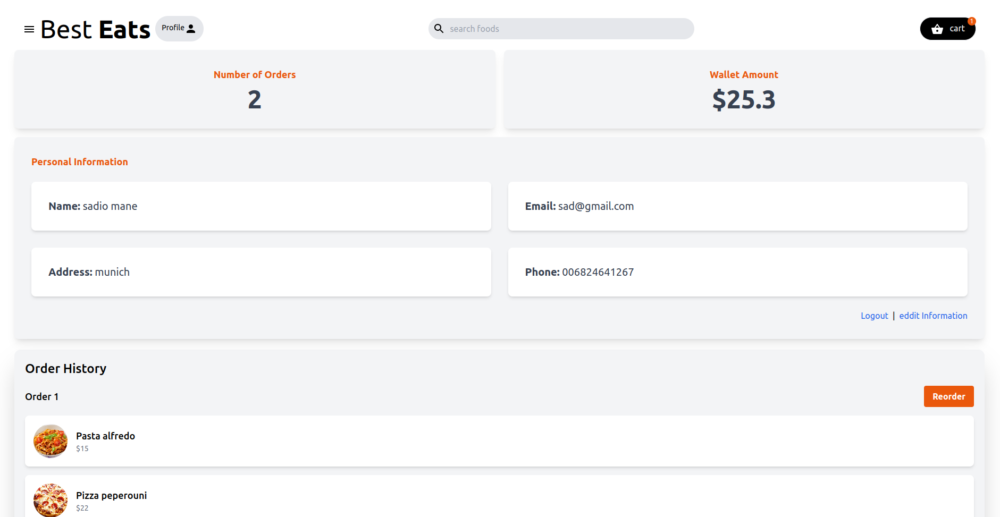

# Best Eats

A food shop project built with React, Tailwind CSS, JSON Server, and Axios.

# Description

Best Eats is a food shop project built with React that allows users to browse through different food items, add them to their cart, and place orders. The project uses Tailwind CSS for styling and JSON Server to simulate a backend server for storing food items and user information. Axios is used to fetch data from the server and handle HTTP requests.

# Installation

1. Clone the repository to your local machine.
2. Install dependencies by running npm install.
3. Start the JSON Server by running npm run server.
4. Start the React app by running npm start.

# Usage

Once the app is running, you can browse through different food items on the home page, add them to your cart, and place orders. The app will store the order information in the server's database.

# Screenshots

### Homepage

### Profile

### cart

# Contributing

Contributions to this project are welcome. To contribute, follow these steps:

1. Fork the project.
2. Create a new branch.
3. Make your changes and commit them.
4. Push your changes to the forked project.
5. Submit a pull request

## mohammadabbsi378@gmail.com
